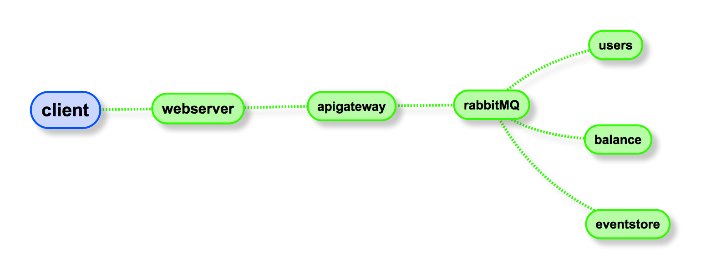

# event-source-test
**Server**: RabbitMQ + Java micro services + Orientdb + each running in Docker containers.

**Client**: Aurelia.

This is an experiment to:
- Communicating between services (than may run in different containers|servers) using a queue message (instead of api-points|socket).
- Store state as event source and cqrs.

## How it works
1. `sh build.sh` will build (in-order) the jar's for the microservices then it will start docker containers
2. open browser and load `http://localhost:8888`

#### IMPORTANT NOTE
**if you're getting an error when loading localhost:8888:**
the reason is that the state might be requested before the eventstore has loaded

To refresh the user list by refreshing money and users:
- `docker restart fz_money` 
- `docker restart fz_users`

# Services
RabbitMQ handles communication between services

### apigateway
- entry point from Client to Server.
- dispatches messages to rabbitmq queues and listens back to chain actions.

### eventstore
- This is the database (orientdb embedded) and also listens for **eventstore** queue from rabbitMQ and stores a record in disk.
- when **users** or **money** services start, they request all events to put the memorydb up to date

### users
- when loads requests all events since begining of time from **eventstore**
- listens to queue **user.user**

### money
- when loads requests all events since begining of time from **eventstore**
- listens to queue **user.money**

### webserver
- `http://localhost:8888` will load the example client.
- it's a simple embedded jetty server that loads files from a folder

### Todo
- Snapshots of state
- Fix stuff :)
